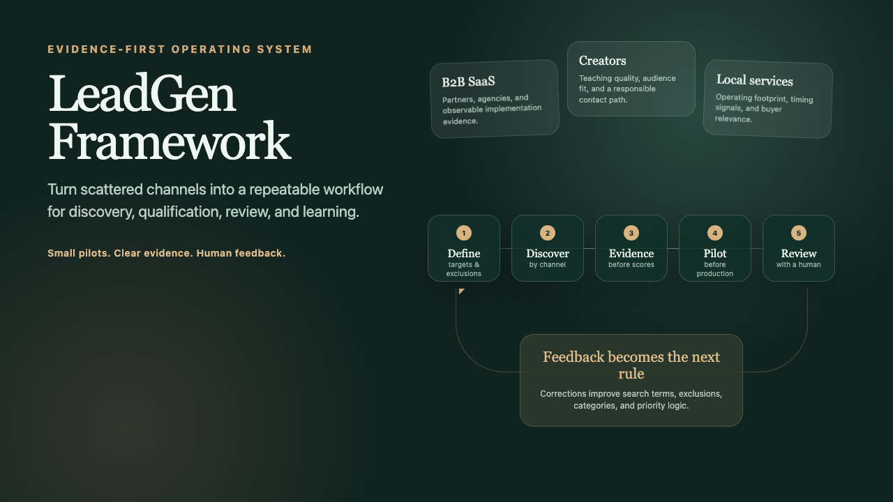
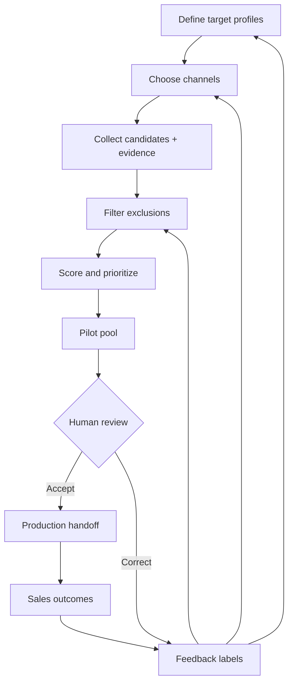

# LeadGen Framework

**An evidence-first framework for multi-channel lead discovery, qualification, pilot testing, and sales feedback loops.**



[](./SKILL.md)
[](#pilot-before-production)
[](./references/publication-checklist.md)

Most lead-generation problems are not caused by a lack of names. They come from weak targeting, missing evidence, inconsistent judgment, premature bulk imports, and feedback that never reaches the next search.

LeadGen Framework turns scattered prospecting into a repeatable operating loop:

```text
Target profiles & exclusions
          ↓
Channel search plans
          ↓
Evidence-rich candidates
          ↓
Qualification & priority
          ↓
Small pilot pool
          ↓
Human review
          ↓
Production handoff
          ↓
Sales feedback → better rules
```

This repository packages that method as a reusable Codex Skill. It is **not a scraper**, does not include private lead data, and does not assume one industry or data source.

## Why This Exists

The framework was shaped by real multi-channel operational work. The private implementation contains company-specific targets, source logic, records, and sales processes; none of those belong here.

The public version keeps the portable system design:

- start with target profiles and explicit exclusions;
- preserve evidence for every candidate;
- use channel-specific discovery strategies;
- qualify in small, reviewable batches;
- keep uncertain data outside production;
- treat human corrections as training material for the workflow;
- measure usefulness, not just volume.

## Core Workflow



## The General Model

Every industry adapter defines the same seven things:

1. **Target profiles** — who or what counts as a useful lead.
2. **Exclusions** — known false positives and out-of-scope groups.
3. **Evidence signals** — observable facts that support fit.
4. **Channels** — where those signals are likely to appear.
5. **Contactability** — whether there is a realistic next step.
6. **Priority logic** — why one candidate deserves attention before another.
7. **Feedback labels** — what the human reviewer or sales team should return.

Use [`templates/industry-adapter.template.md`](./templates/industry-adapter.template.md) to define a new market without changing the core workflow.

## Pilot Before Production

New channels, search terms, and scoring rules begin in a small pilot pool. A pilot should be large enough to reveal patterns and small enough for a person to inspect every row.

Production import happens only after checking:

- required fields are complete;
- URLs and evidence support the classification;
- obvious exclusions are removed;
- priorities have auditable reasons;
- identifiers and labels are consistent;
- a rollback or correction path exists.

This separation prevents a fast experiment from silently becoming permanent CRM noise.

## Evidence Before Scores

A lead should never be just a name and a number. The default schema preserves:

- source URL and channel;
- category and market;
- product or service evidence;
- audience, activity, or company signals;
- contact path;
- fit explanation;
- priority reason;
- verification notes;
- reviewer or sales feedback.

The score supports sorting. The evidence supports trust.

## The Feedback Loop

Useful feedback is operational, not vague:

| Feedback | What the system can learn |
| --- | --- |
| Wrong category | Refine category definitions and examples. |
| Wrong market or language | Add detection and exclusion rules. |
| Weak product fit | Tighten required evidence. |
| Bad or stale URL | Improve source verification. |
| Useful but unreachable | Separate fit from contactability. |
| Strong pattern | Search for more candidates with the same observable signal. |
| Replied or progressed | Study which evidence correlated with downstream value. |

Read [`references/evaluation.md`](./references/evaluation.md) for measurement guidance.

## Cross-Industry Examples

All examples are fictional and demonstrate the same framework with different signals:

- [`examples/b2b-saas-partners.md`](./examples/b2b-saas-partners.md) — integration and agency partners for a fictional workflow SaaS.
- [`examples/creator-partnerships.md`](./examples/creator-partnerships.md) — educators and creators for a fictional language-learning product.
- [`examples/local-service-buyers.md`](./examples/local-service-buyers.md) — multi-location buyers for a fictional commercial maintenance service.
- [`references/cfd-example.md`](./references/cfd-example.md) — an industry-specific adaptation using no private company or lead data.

## Install as a Codex Skill

Copy or clone this repository into your Codex skills directory:

```bash
mkdir -p ~/.codex/skills
git clone https://github.com/keer-d/leadgen-framework.git ~/.codex/skills/leadgen-framework
```

Start a new conversation and ask:

```text
Use $leadgen-framework to design a lead generation pilot for my market.
```

The available tools determine execution. The Skill can work with search, browser sessions, APIs, spreadsheets, Base/CRM connectors, or manual review workflows; it does not pretend those integrations exist when they do not.

## Repository Map

```text
.
├── SKILL.md
├── agents/openai.yaml
├── examples/                  # Fictional cross-industry adaptations
├── templates/                 # Adapter and pilot templates
├── references/
│   ├── evaluation.md
│   ├── cfd-example.md
│   └── publication-checklist.md
└── docs/                      # Cover and editable visual source
```

## How It Was Built

I developed the framework by repeatedly turning an ambiguous lead request into target definitions, channel plans, evidence fields, pilot pools, review rules, and feedback updates. AI agents help research, structure, normalize, and assess candidates; humans define the market, verify uncertainty, and decide what enters production.

The main lesson was simple: adding more automation did not automatically improve lead quality. The system became more useful when evidence, review boundaries, and correction labels became explicit.

## Limits

- The Skill is an operating framework, not a universal lead source.
- Channel access, platform rules, and available APIs change.
- A priority score is not a prediction of commercial success.
- Public information still requires responsible handling and applicable privacy compliance.
- Downstream sales outcomes depend on offer, timing, outreach, and market conditions—not discovery alone.

## Privacy

Before publishing an adapter or derived case study, follow the [publication checklist](./references/publication-checklist.md). Never commit API keys, cookies, CRM identifiers, real private lead records, employee performance data, or proprietary targeting strategy.

## License

The framework, templates, and Skill instructions are available under the [MIT License](./LICENSE).
